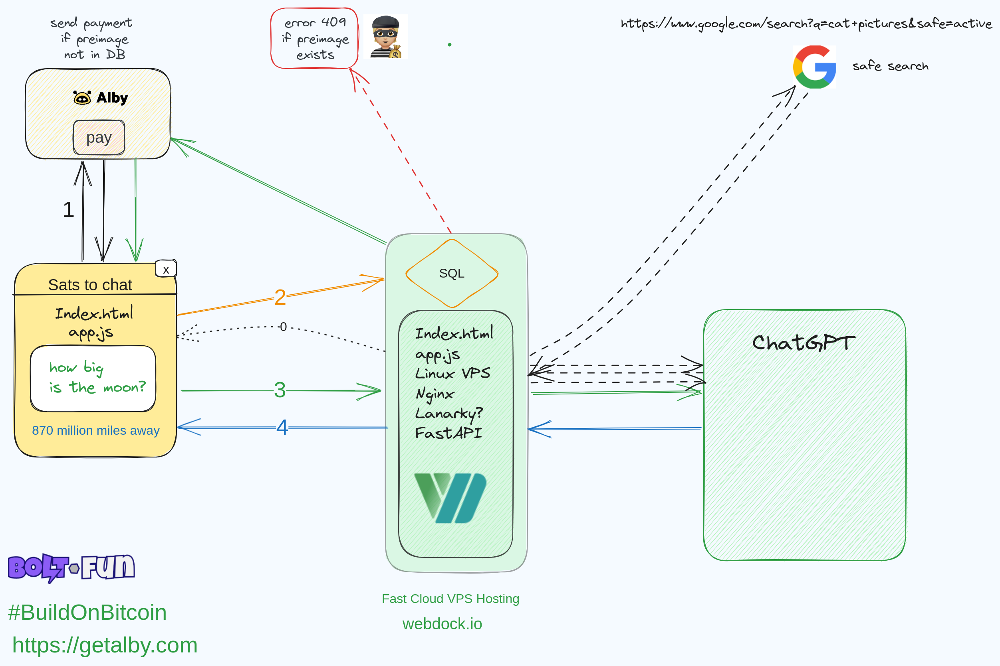

### WebLN OpenAI Chat

This is project shows how you can integrate WebLN into your site to collect payment for the OpenAI chatGPT API calls.

The idea was to make a basic example to allow anyone from a mainly Python background to build the backend with Python and only need the minimum vanilla JavaScript.

Getalby provides the WebLN functionality whilst Nginx provides the reverse proxy and Lanarky gives the LangChain functionality with an endpoint to use: ChatOpenAI

The Sqlite database holds all recent preimages to prevent an attempt at double spend. The Nginx proxy limits requests to the API solely from the localhost.

  `raise HTTPException(status_code=409, detail="Preimage already exists")`

* [X] WebLN payment
* [ ] Redo API with LangChain Tools (Langcorn)
* [ ] Vector Database : Qdrant/Docker - Similarity Search
* [ ] Safe Search (Google, others)
* [ ] Accessibilty
* [X] Test

